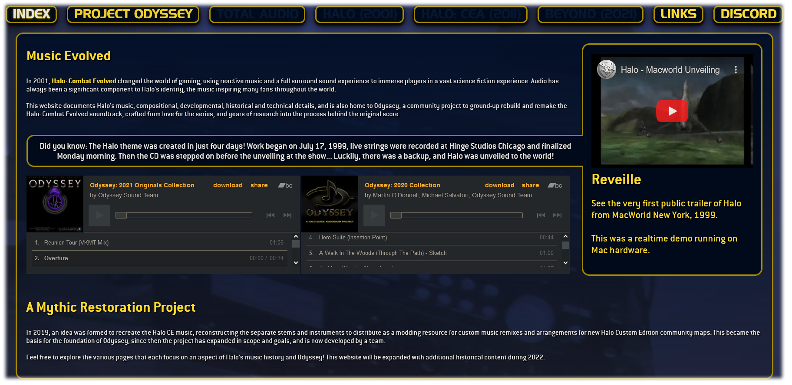

> *Please note, this repo was deprecated in 2020 when it became clear that the project file size for multiple FLAC and WAV audio files would not be feasible via GitHub. The [Odyssey Audio](https://www.odysseyaudio.org) website now maintains the latest information, and you can follow the project live at the [Halo Modding Reclaimers Discord.](https://discord.reclaimers.net)*

>*This page was last updated on **Thursday, 14th July, 7:45pm**, New Zealand Time.*

> *Actual project distribution will be reinvestigated closer to the first complete public release (audio stems, game tags and a campaign package including Odyssey music.)*
*** 

*** 
# A Mythical Music Addendum Project.
Since 2019, we've worked to archive details of the music of Halo CE (and 2/3 to a smal extent).

	Click the above image to view a video on the project (November, 2021)

From research of interviews, press articles and audio discussion fossilized on the *[Internet Archive](https://archive.org/)*, to direct confirmations and reminiscence by the legacy audio team, and our own technical and sonic studies and reconstructions on the same hardware used in Halo's production, Odyssey encompasses a great journey to accurately and *authentically* reconstruct the Halo sound of the 2001 classic at a new, previously unrealized definitive quality.

	Click the above image to browse the Odyssey Audio website.
*** 
# COOL LETTERBOX CHAPTER TEXT HERE

Some of the core team's work on Odyssey already, and their future milestones include:
+ Acquiring/collecting the genuine same hardware synthesizers, and documenting the differences/shortfalls in available software substitutes, if any exist.
+ Studying the internal sample/program/ROM data of these synthesizers to find the sounds used across the original Halo trilogy.
+ Recreating the melodies and detailed compositions of Halo.
+ Confirming the audio software and processors used in Halo's production (this also includes sound effects and voiceover audio processing across the trilogy.)
+ Maintaining documentation on all identified or suspect sound ingredients for Halo.
+ Rebuilding the Halo soundtrack as 1:1 as possible.
+ Providing a foundation for an additional remix of CE music, provided as an alternative to the official Anniversary music, our take on how we imagine it might have been.
+ Authoring a professionally detailed "restoration" of Halo CE's music in 96khz, more than *double* the resolution of the highest known quality source of Halo's music.
	* The official Halo soundtrack is 44.1khz / CD quality, but only includes about 60% of all known composed music for the game.
+ Analyzing the technical quality of all possible sources of Halo CE's music:
	
	* The 2001 Xbox release is destructively compressed to a custom ADPCM format for Xbox hardware, and is ~64kbps (significantly lower quality than most modern MP3 files). Game releases include ~80% of all known composed music, except for CEA 2011 (see below).

	* The 2003 Gearbox release is higher quality than Xbox but still lossy, approxiamtely ~120kbps, in OGG Vorbis format.
	
	* The 2003 Gearbox's marketing beta had *further* higher bitrate music, approxiamtely ~160kbps, in OGG Vorbis format.
	
	* The 2011 360 release of Halo CEA is the highest game quality but the music data has been rerendered with crossfades between loops that are destructively unsuitable to be used in other versions, however CEA also includes additional unused music in the files, presumably supplied to the Anniversary production team, totalling approximately ~90% of all known composed music. This music was rendered to approximately ~200kbps in XMA format.
	
	* The 2014-2020 release of Halo CE within MCC used FMOD packaged music, **lower quality than the 2003 release.** ~90kbps in MP2 format.
	
	* The 2021 update to MCC reverted from FMOD back to the game's internal 2003 music data, and is audibly identical in every way to the music of that Gearbox 2003 release.

+ Releasing all assets and resources of Odyssey's development across a range of formats:
	* Premade tag releases, a "drop & go" format that is already ready to use with game engine development tools (Halo Custom Edition Editing Kit, Halo CE Mod Tools, H2 Mod Tools, etc)
	* Complete audio stems and loops available for all components of both the 1:1 and enhanced recreations in 44khz and 96khz, in 320kbps OGG Vorbis, 24-bit FLAC and 16-bit WAV.
	* MIDI track releases and subsequent "transcriptions" of our recreations of the original music.
	* REAPER project releases (including stems, audio tracks, information on VST plugins) for all tracks produced in REAPER (some tracks are produced in other DAWs)
	* Additional documentation including compositional and technical notes.
	* (Free) "arranged" albums of all Odyssey material that mirrors the structure of the official soundtracks, available on [Bandcamp](https://music.neoteaika.com), [Discord](https://discord.reclaimers.net), the [Odyssey Audio](https://odysseyaudio.org/) website and [ModDB](https://www.moddb.com/mods/halo-odyssey).
*** 
# IMPORTANT NOTES OF A LEGAL AND DISCLAIMER-Y NATURE
**Our team does not include legal experts, we're just passionate musicians**, so if anything about this project raises concern, please directly contact the owner of this GitHub repo for further enquiries or discussions.
> 
> Direct rearrangements/restorations/recreations of the music from Halo CE, by definition, *are legally covers of compositional by Martin O'Donnell and Michael Salvatori*. The compositional and performance rights belong to O'Donnell/Salvatori Inc. and *[ASCAP](https://www.ascap.com)*.
>
>You should contact *[ASCAP](https://www.ascap.com)* if you are looking to license official Halo music. We are a fan project and *cannot* grant permissions on anyone's behalf.
> 
> The rights of *all new* Odyssey compositions belong to the individuals that produced them, but likely include the primary team, [N. Te Aika](https://neoteaika.com/portal) and [N. Mitchell](https://twitter.com/Peakabooey). Credits of individual tracks are listed on Bandcamp and in track metadata.
> 
> *Odyssey itself is created for the purposes of education and research.* Odyssey is *not* for sale, and is always intended by it's creators, to be freely available for listening, study and as a modders' resource for custom Halo content.
> 
> You are free to use our work on YouTube or other coverage of our project, we just ask that you help make this project known and credit our work (we would really appreciate the raised awareness!)
> 
> *Odyssey Sound Team is not responsible for legal action regarding users of the project that monetize, sell or otherwise unlawfully claim ownership of the work.*
*** 
# INFO FOR AUDIO PEOPLE

The full index is available on our [Odyssey Audio Spreadsheet](https://odysseyaudio.org/spreadsheet), but here is a shortlist of known synthesizers used in Halo's production:
+ E-MU Proteus, Proteus 2, Proteus 3 (only used in 1999)
+ E-MU Procussion
+ E-MU Proteus 2000 (Composer & Protozoa ROM)
+ E-MU Emulator IV (E4XT Ultra)
+ Kurzweil K2500X (Base, Contemporary & Orchestral ROM)
+ Roland JD-990
+ Roland XV-5080 (SRX-06 Complete Orchestra)

Known DAWs used during Halo CE's production :
+ Opcode Studio Vision Pro 4+, 1998 (Mac OS 9)
+ MOTU Digital Performer 3+, 2001 (Mac OS 9-Max OSX)
+ Digidesign Pro Tools 5~, 1999 (Mac OS 9-Mac OSX)
+ BIAS Peak 2.02+, 1998 (Mac OS 9)
